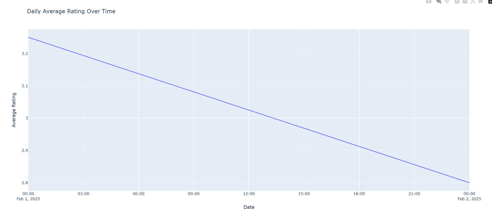

#  Lab 1 – Python-only Data Pipeline
**Product Analytics – AI Note-Taking Applications**


---
Feedback:
- You are limiting the possibilities of your code as you list the apps to search for, use a query term rather than app id.

- Use continuation tokens in reviews so you can get as much data as possible. Remember, more data, richer analyses in downstream tasks

- It’s good to separate layers’ logic in code files. Kudos on that.

- Think about writing with **append** in the loop for retrieving reviews with pagination; it is always better to prevent data loss if code crashes

- Please add a screenshot of your dashboard to the readmefile


---

##  Project Overview

This project implements a **Python-only end-to-end data pipeline** following the main stages of the data engineering lifecycle:

* Data acquisition & ingestion
* Data transformation & cleaning
* Serving layer (analytics-ready datasets)
* Lightweight dashboarding
* Pipeline stress testing (C1 / C2)

The objective is to transform **raw, semi-structured data** into **reproducible, analytics-ready outputs**, while exposing common weaknesses of early-stage pipelines.

---

##  Project Structure

```text
lab1/
├── data/
│   ├── raw/                # Raw upstream data (JSON, JSONL, CSV)
│   └── processed/          # Cleaned & aggregated datasets
├── screenshots/            # Dashboard screenshots (README)
├── src/
│   ├── scraper.py          # Data acquisition (Google Play)
│   ├── transformer.py      # Transformation logic (A, B, C1)
│   ├── tranformer_c2.py    # Schema drift adaptation (C2)
│   ├── serve.py            # Serving layer (KPIs, daily metrics)
│   └── dashboard.py        # Dashboard visualization
└── README.md
```

---

##  Part A & B – End-to-End Pipeline (Baseline)

### Data Sources

* **Applications metadata** (JSON)
* **User reviews** (JSONL)

Raw data is ingested without modification and stored in `data/raw/`.
Transformation logic converts semi-structured inputs into tabular datasets stored in `data/processed/`.

---

## 📊 Dashboard Results – Part A & B

### Daily Number of Reviews


**Observation:**
The number of reviews increases over time, with clear spikes indicating periods of higher user activity.
This suggests growing adoption of AI note-taking applications.

---

### Daily Average Rating Over Time


**Observation:**
User ratings remain globally stable around **4–4.5**, with occasional short drops.
These dips may correspond to releases or updates that negatively impacted user experience.

---


## 🔄 Part C1 – New Reviews Batch (CSV)

In this scenario, the upstream reviews dataset is replaced by a **new CSV batch** (`note_taking_ai_reviews_batch2.csv`), treated as the **sole input source**.

### Code Adaptation

* Introduction of a configuration switch (`USE_CSV_BATCH`)
* Explicit selection of reviews source (JSONL vs CSV)
* No changes required in the serving layer or dashboard

---

### Dashboard Results – C1



**Observation:**
The CSV batch contains a very small number of reviews.
As a result, metrics are less stable and less representative compared to the original JSONL dataset.
This highlights the sensitivity of analytics to batch size and data volume.

---

### C1 – Observations

**How many changes were required?**
Only minimal changes were needed, limited to the transformation layer.

**Full refresh or implicit behavior?**
The pipeline clearly performs a **full refresh**, recomputing all outputs from scratch at each run.

**How are duplicate reviews handled?**
Reviews are deduplicated using `reviewId`, keeping the most recent occurrence.

**What about unknown applications?**
Reviews referencing applications not present in the apps catalog are preserved and labeled as `UNKNOWN_APP`, making data quality issues explicit.

---

## 🧬 Part C2 – Schema Drift in Reviews

In this scenario, the reviews dataset (`note_taking_ai_reviews_schema_drift.csv`) introduces:

* Renamed columns
* Different field structure
* Changed naming conventions

The raw file is **not modified manually**.

---

### Pipeline Behavior (Before Adaptation)

* The pipeline fails explicitly due to missing expected columns
* Errors surface during column selection and transformation
* This reveals strong assumptions on column names

---

### Adaptation Strategy

* Schema normalization layer introduced
* Flexible column mapping (e.g. `review_text → content`)
* Changes localized to the transformation script (`tranformer_c2.py`)

---


### C2 – Observations

**Hard-coded assumptions:**
Column names in the transformation layer were the main source of fragility.

**Failure mode:**
The pipeline failed **explicitly**, which is preferable to silently producing incorrect results.

**Scope of changes:**
All required changes were localized to the transformation layer, leaving serving and dashboard logic unchanged.

---

## 🧠 Key Takeaways

* Early-stage pipelines are highly sensitive to schema and format changes
* Explicit full-refresh logic improves reproducibility
* Clear separation between ingestion, transformation, and serving layers reduces maintenance cost
* Data quality issues should be exposed, not hidden

---

## ✅ Conclusion

This lab demonstrates the complete lifecycle of a Python-based data pipeline and highlights why more structured tools (schemas, contracts, orchestration frameworks) become necessary as systems evolve.

